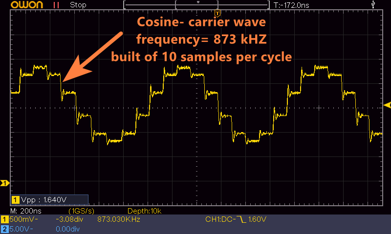

# ESP32 AM Radio Transmitter v2

This sketch for ESP32-microcontroller initiates an AM radio transmission within the medium wave band which could be listened to with a standard AM radio-receiver.

## Working Principle

Amplitude modulation (AM) is the easiest way of creating modulated radio broadcasts, hence it is quite suitable to be reproduced with an ESP32. AM Radio transmissions are based on a carrier signal which is modulated by the audio signal. You can read about AM at: [en.wikipedia.org/wiki/Amplitude_modulation](https://en.wikipedia.org/wiki/Amplitude_modulation)

To create the high frequency (HF) radio signal, we are using one of ESP32's built-in digital-to-analog converter (DAC). The ESP32 modulates the content of an additional Audio-headerfile with the HF-cosine carrier wave and transmits the resulting AM-signal in a continuous loop to the air. Since the power of ESP32's DAC-output is quite limited, also the resulting range of the transmission is limited to some meters only. This is good for safety, cause this will prevent radio interference with your neighbors.

The frequency of transmission could be chosen from 6 predefined values between 549-1431 kHz.

## Hardware

ESP32's hardware, the DAC-timing and especially the use of latest DAC-API is being pushed to the limit here. Faster frequencies or more samples per carrier-cylce will make the ESP32 to partly interrupt the signal or even stop from sending a signal at all.
I've tested the sketch with a standard ESP32 on a standard Dev-Module. It might work on other chips of the ESP32-family too. But because of the high timing limits, that's not for sure - you've to test it yourself on your specific module and with the help of an oscilloscope. 

A good tip for measuring an HF-signal at ESP32's DAC-pin: You'll get clearer, quicker changing signal if you put a resistor of about 330 ohm between DAC-pin 25 and GND. Without the resistor especially the falling ramp of the signal is quite slow.



## Usage

The sketch is written in Arduino-IDE, so the easiest way is using this Arduino-IDE too, but it also could be used with other IDEs by slightly adapting the code. 

The first task you've to do is converting an audio file (music etc.) of your choice to a header-file be using the converter "AudioToHeader.html". You've to test about the maximum length of your Audiofile, I attached one with 2 minutes.
Open your audio file, optionally select "normalize", and I advise to also select "resample with" with a number like 6000. Otherwise the headerfile would be too large and could not be loaded into ESP32's memory.

Then you've to adjust the code of AMRadioTransmitter.iso on 2 lines:
* in the first line change the filename to your converted header-file
* in the second line you can change the value of "FREQ" (0-5) to your desired AM-frequency

```cpp
#include "Blue_danube.h"
#define FREQ 3
```

## Antenna

The best wave propagation and resistance to interference is achieved with a loop-antenna with 2 connectors to GND-Pin and DAC-Output-Pin 25 of ESP32.
Additionally to the loop-antenna you can connect a long wire (e.g. 2 meter) or alternatively touching DAC-Pin with your Finger, which slightly enhances an already weak signal far away the ESP32. 


## History

* Idea and original code: "AM Radio Transmitter" by bitluni [youtube.com/bitlunislab](https://youtube.com/bitlunislab) - sending him a warmly "High five"! : [github.com/bitluni/ESP32AMRadioTransmitter](https://github.com/bitluni/ESP32AMRadioTransmitter)
* Project page: [bitluni.net/am-radio-transmitter](https://bitluni.net/am-radio-transmitter) | Project video: [youtu.be/lRXHd3HNzEo](https://youtu.be/lRXHd3HNzEo)
* "AM Radio Transmitter" just runs on legacy Arduino-ESP32 <= v2.x (based on ESP-IDF <= 4.4)
* Completely re-coded and speed-optimized to work with modern ESP32-API by PPete [www.ppete.de/](https://www.ppete.de/)
* "AM Radio Transmitter v2" now runs on Arduino-ESP >= v3.x and ESP-IDF >= v5.1
* Added Multi-frequency selection

## License

AM Radio Transmitter v2 is licensed by MIT License.
Please give appropriate credit to the developers by mentioning their names and weblinks, thank you!
* bitluni: https://bitluni.net/
* PPete: https://www.ppete.de/ 